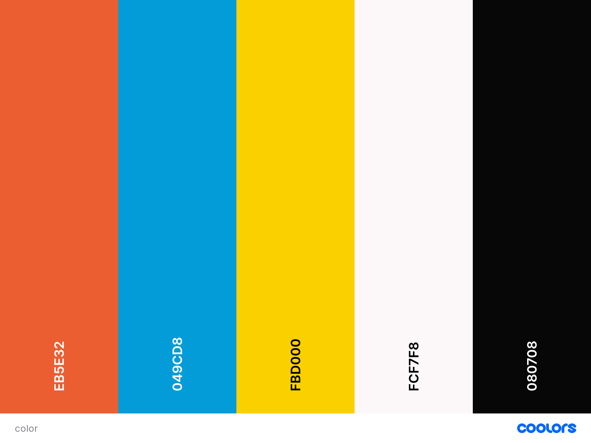
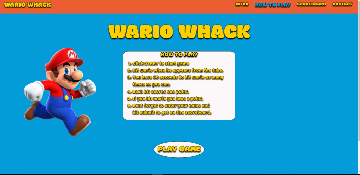
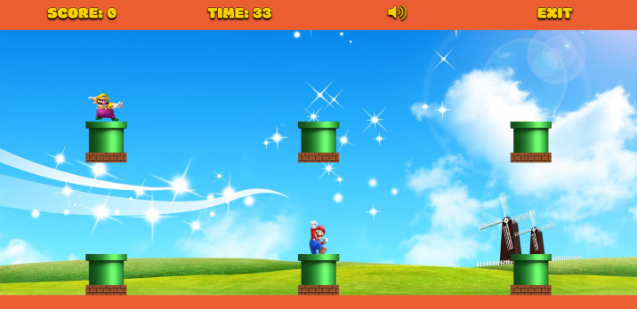
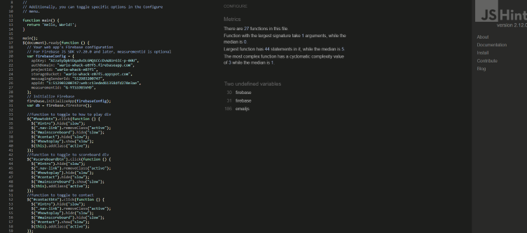

# **WARIO WHACK**
Wario Whack is a project i have created as part of my Full Stack Web Development course with Code Institute.

## Contents

- [**User Experience Design (UXD)**](<#UXD>)

  - [Project Goals](<#project-goals>)
  - [User Stories](<#user-stories>)
  - [Website Structure](<#website-structure>)
  - [Design Decisions](<#design-decisions>)
    - Colours
    - Images
    - Typography
  - [Wireframes](<#wireframes>)
  - [Design Changes](<#design-changes>)

- [**Features**](#features)

- [**Technologies Used**](#technologies-Used)

- [**Testing**](#testing)

- [**Deployment**](#deployment)

- [**Credits**](#credits)
## UXD
### Project Goals
The goal of the project is to create a fun game for all ages based on the Nintendo characters Mario and Wario in a whack a mole style game setting. 

### User stories

- #### User goals

    + As a **user** i want to instructions how to play the game
   + As a **user** i want to be able to play the game on any device.
   + As a **user** i want to compete with my friends playing the game.
   + As a **user** i want to be able to mute any audio on the site.
  + As a **user** i want feedback on how im doing in the game.
  + As a **user** i want to be able to give feedback on the game.

- #### Site Owner Goals
  + As a **site owner** i want the user to have fun playing the game
  + As a **site owner** i want a way to get feedback from the user
  + As a **site owner** i want the site stucture to be simple for the user to navigate
  + As a **site owner** i want the game to be playable on any device.
  + As a **site owner** i want the site to be attactive to make users want to return.

### Website Structure
I decided to keep the gameplay separate from the rest of the information on the site to keep the player undistracted from the gameplay so the site will have two pages. The main page will incorporate the intro, instructions, scoreboard, contact info and link to the game page. The gameplay page will contain the game itself and the relevant feedback to the player aswell as neccessary buttons to mute audio and exit back to the main page. 
###  Design Decisions
#### Colours
I used colors on the site to complement the mario and wario characters the color palette was generate by [coolers](https://coolors.co/).

#### Images
- The images for the home page and the gameplay are taken from [seekpng](https://www.seekpng.com/ks/clipart/) then changed using figma to suit the gameplay.
- The background image in the gameplay was taken from [Here](https://wallpaperaccess.com/cartoon-sky)

#### Typography
I decided to use [MODAK](https://fonts.google.com/specimen/Modak) font for the site as i felt it created a gameing vibe on the site and matched the style of the gameplay.  
### Wireframes
The wireframes were created using [Figma](https://www.figma.com)
#### Homepage intro
- [HOME INTRO DESKTOP](https://github.com/noelmurphy33/WARIO-WHACK/blob/master/assets/wireframes/homeintro.png)
- [HOME INTRO MOBILE](https://github.com/noelmurphy33/WARIO-WHACK/blob/master/assets/wireframes/homeintromobile.png)
- [HOME INTRO TABLET](https://github.com/noelmurphy33/WARIO-WHACK/blob/master/assets/wireframes/homeintrotablet.png)
#### Homepage game instructions
- [GAME INSTRUCTIONS DESKTOP](https://github.com/noelmurphy33/WARIO-WHACK/blob/master/assets/wireframes/howtoplay.png)
- [GAME INSTRUCTIONS MOBILE](https://github.com/noelmurphy33/WARIO-WHACK/blob/master/assets/wireframes/howtoplaymobile.png)
- [GAME INSTRUCTIONS TABLET](https://github.com/noelmurphy33/WARIO-WHACK/blob/master/assets/wireframes/howtoplaytablet.png)
#### Scoreboard
- [SCOREBOARD DESKTOP](https://github.com/noelmurphy33/WARIO-WHACK/blob/master/assets/wireframes/scoreboard.png)
- [SCOREBOARD MOBILE](https://github.com/noelmurphy33/WARIO-WHACK/blob/master/assets/wireframes/scoreboardmobile.png)
- [SCOREBOARD TABLET](https://github.com/noelmurphy33/WARIO-WHACK/blob/master/assets/wireframes/scoreboardtablet.png)
#### Contact form
- [CONTACT FORM DESKTOP](https://github.com/noelmurphy33/WARIO-WHACK/blob/master/assets/wireframes/contact.png)
- [CONTACT FORM MOBILE](https://github.com/noelmurphy33/WARIO-WHACK/blob/master/assets/wireframes/contactmobile.png)
- [CONTACT FORM TABLET](https://github.com/noelmurphy33/WARIO-WHACK/blob/master/assets/wireframes/contacttablet.png)
#### Gameplay 
- [GAMEPLAY DESKTOP](https://github.com/noelmurphy33/WARIO-WHACK/blob/master/assets/wireframes/gameplay.png)
- [GAMEPLAY MOBILE](https://github.com/noelmurphy33/WARIO-WHACK/blob/master/assets/wireframes/gameplaymobile.png)
- [GAMEPLAY TABLET](https://github.com/noelmurphy33/WARIO-WHACK/blob/master/assets/wireframes/gameplaytablet.png)
#### Gameplay finished 
- [GAMEPLAY FINISHED DESKTOP](https://github.com/noelmurphy33/WARIO-WHACK/blob/master/assets/wireframes/gameplayfinishcard.png)
- [GAMEPLAY FINISHED MOBILE](https://github.com/noelmurphy33/WARIO-WHACK/blob/master/assets/wireframes/gameplayfinishcardmobile.png)
- [GAMEPLAY FINISHED TABLET](https://github.com/noelmurphy33/WARIO-WHACK/blob/master/assets/wireframes/gameplayfinishcardtablet.png)
### Design changes
- I decided to add a footer to the home page with a few links as it made the page look better.
- i decided to use solid black as it made the text and borders more defined.
## Features
### Existing Features
- The site has two responsive pages the home page contains the info on the game such as the scoreboard, the intro, a contact form, and a section with instructions on how to play the game. Each of these items are toggled via the nav buttons, a large button under this content will then take you to the game page. The footer contains some links to sites about mario and also this repository.

- The gameplay page consists of a game console on top which contains feedback to the player about score and time left aswell as a button to toggle the sound effects and a link to exit back to the home page. The game itself lasts 60s and the idea is to hit wario to increase your score. The game is started by the start button in the center of the screen.

- Once the game time is up you can enter your name and submit to get on the leader board, you can also choose to play agin which will reset the game or quit to home page via the buttons.

### Features to be added
- Add levels to the game which increase the difficulty.
## Technologies Used
### Languages
+ [HTML](https://en.wikipedia.org/wiki/HTML) - Used as the main language for structuring the website.
+ [CSS](https://en.wikipedia.org/wiki/CSS) - Used as the main language for styling the website.
+ [JavaScript](https://www.javascript.com/) - Used as the main language for providing functionality to the game.

### Frameworks, libraries and programs
- [Bootstrap ver 4.6](https://getbootstrap.com/docs/4.6/getting-started/introduction/) 
- [jquery](https://jquery.com/)
- [Google fonts](https://fonts.google.com/) 
- [Fontawesome](https://fontawesome.com/) used for icons in the site.
- [Github](https://github.com/) used as the repository for this project.
- [gitpod](https://gitpod.io/) used as the online IDE to develop this site.
- [git](https://git-scm.com/) used for verion control.
- [Autoprefixer](https://autoprefixer.github.io/) used to add vender prefixs to CSS.
- [favicon.io favicongenerator](https://favicon.io/favicon-generator/) used to create and code the favicon for the site.
- [Tinypng](https://tinypng.com/) used to compress the filesize for the images.
- [Mircosoft Photos](https://www.microsoft.com/en-us/p/microsoft-photos/9wzdncrfjbh4?activetab=pivot:overviewtab)
used to resize the images.
- [Chrome dev tools](https://developers.google.com/web/tools/chrome-devtools) used to test the website throughout the development.
- [W3C Mark up Validater](https://validator.w3.org/) used to test my html files.
- [W3C css validator](https://jigsaw.w3.org/css-validator/) used to test my style sheet.
- [jshint](https://jshint.com/)used to test my js
- [Google Firebase](https://firebase.google.com/) used to store score data
## Testing
### Code Validators

I used [w3.org's validator](https://validator.w3.org/) for my HTML validation checks on both pages.

- no errors or warnings

I used [w3.org's validator](https://jigsaw.w3.org/css-validator/) for my CSS validation checks.

- No errors were found.

I used [JSHint](https://jshint.com) to check the javascript  no errors detected.

### RESPONSIVENESS 
To Check the responsiveness of the site I used [Chrome DevTools](https://developers.google.com/web/tools/chrome-devtools) and various devices at my disposal. the site scales well on most devices however it is best to change to landscape playing the game on devices smaller then iphone 4.

### Browser compatability
 I tested the website on the following browsers
 - Mircosoft edge
 - Opera
 - Google chrome
 - Mozilla Firefox 
 - Safari
 No noticeable issues found

 ### Testing User Stories
   As a **user** i want to instructions how to play the game
   - instructions giving on the home page.
   As a **user** i want to be able to play the game on any device.
   - the game is responsive and can be played on any device
   As a **user** i want to compete with my friends playing the game.
   - through the use of google firebase the data is stored from the leader board and updated continuously.  
    As a **user** i want to be able to mute any audio on the site.
   - The site is muted by defualt and is easy to unmute if one wishs  
   As a **user** i want feedback on how im doing in the game.
  - The feedback is provided by score and time displayed as well as sounds while unmuted.
   As a **user** i want to be able to give feedback on the game.
   - Feedback can be given via a contact form on the homepage which via emailjs will be sent to me.

   As a **site owner** i want the user to have fun playing the game
  - The game is fun to fun on any device
   As a **site owner** i want a way to get feedback from the user
  -  The contact form on the home page
   As a **site owner** i want the site stucture to be simple for the user to navigate.
   - The layout of the site is intuitive and the user can easily find any info they need.
   As a **site owner** i want the game to be playable on any device.
   - The game page is responsive and can be used on any device.
  As a **site owner** i want the site to be attactive to make users want to return.
  - The colors are bright and appealing images and animations make the site fun and attractive to users of any age.
### Furter Testing
In general i used the console in dev tools to find any issues i was having with my code.
i also manually tested each feature as i implemented them.

### BUGS
- I had a few issus with implementing firebase to the project as the documentation is very intuitive.
  the issue was mainly dealing with the data i retrieved from firestore so i ended up changing my table in html
   and using js to create the scoreboard.

- because i used two separate html pages for one js file i had to use if statements to remove certain null errors 
which were stopping the gameplay.

## Deployment
**GITHUB PAGES** 

I deployed my site to github pages via the following

1. I Logged into github
2. I then went to my repositories via the avatar dropdown on the navbar.
3. I then clicked the repository i wanted to deploy.
4. I clicked settings and then scrolled down to the github pages section.
5. I clicked the Branch dropdown and selected master then clicked save.
6. The page refreshed and i returned to the same setting section to get the live link.

**FORKING THE REPOSITORY**

To fork the repository follow these steps:

.1 Login to github and find the repository to fork.

.2 At the right side of the page under the avatar dropdown click the fork button
you should then have a copy of the repository in your repositories.

**LOCAL CLONE**

To create a local clone follow these steps.

.1 locate the repository in github

.2 Just above where you see the repository files clcik the "code" dropdown.

.3 Click the clipboard or select and copy the link.

.4 In your terminal type git clone followed by the link and press enter to crete the clone.

## Credits
- I relied alot on [Franks laboratory](http://frankslaboratory.co.uk/star-wars-whack-a-mole-javascript-game-tutorial-for-beginners/) for the game inception and functionallity. 

- while implementing firebase i used [this](https://www.lucaslang.dev/blog/build-a-scoreboard-using-javascript-and-firebase-cloud-firestore/) site as a guide aswell as the firebase docs.

## Acknowledgements
i would like to thank my family and friend for their continuing support while making this project.